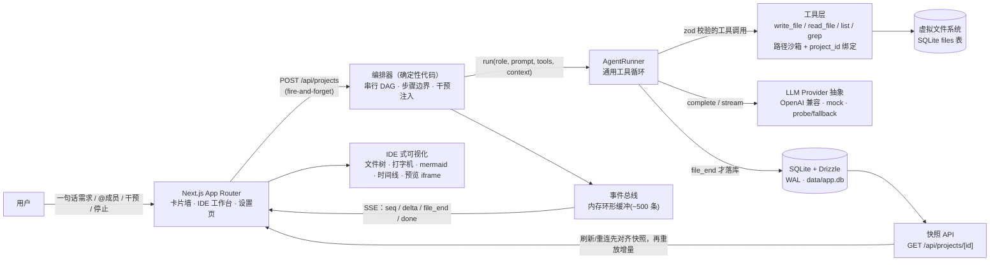

# Atoms-Demo

多智能体团队驱动的应用生成平台（网页版 mini-Atoms，笔试挑战项目）。

用户一句话需求 → 领导 agent 路由分派 → PM / 架构师 / 工程师接力产出 PRD、架构设计（mermaid 图）、全栈代码 → IDE 式界面实时可视化（文件树生长、打字机流式）→ 一键预览全栈应用（浏览器内后端，fetch 拦截装配）。

**核心特性**

- **双层架构**：LLM 只做决策（路由、分派、产出），确定性代码做执行（串行 DAG 调度、SSE、落库、进度）
- **SSE 实时直播**：自写事件协议（`seq` / `Last-Event-ID` 重放）、断线刷新恢复现场、正在生成的文件可续读
- **全栈可运行预览**：生成应用在 iframe 沙箱里真实可交互（CRUD 全流程，浏览器内内存后端）
- **人机共编**：人工编辑与 agent 写入走同一 write API + CAS 乐观锁，冲突 409 → 三选一对话框；软锁 + 语义防冲突
- **检查点回滚**：任务前自动打点，事务内恢复，回滚可撤销
- **可观测**：每次 LLM 调用落 `llm_calls`（token/费用，缺失 usage 按中文校准公式估算并标 `estimated`）
- **可离线演示**：`LLM_PROVIDER=mock` 全链路无需密钥，几十秒跑完一轮

> 设计文档（单一事实来源）：[`docs/DESIGN.md`](docs/DESIGN.md)。技术栈：Next.js 15 App Router + TypeScript(strict) + Tailwind + shadcn/ui + SSE + SQLite(Drizzle/better-sqlite3, WAL)。

---

## 架构



一次生成的数据流：`POST /api/projects` 建项目并后台起跑 → 编排器按拓扑序逐任务执行（工程师按 `file_tree` 逐文件派发单文件任务）→ AgentRunner 循环调 LLM，工具写入**虚拟文件系统**（SQLite，不碰宿主磁盘）→ 事件总线把 `agent_start / file_start / delta / file_end / agent_end / message / intervention_injected / done / stopped / error` 推给 SSE → 前端先取快照对齐状态，再消费增量渲染 IDE。

---

## 30 秒启动

```bash
npm install
npm run db:push     # 应用 Drizzle schema 到 SQLite（data/app.db 自动建目录）
npm run dev         # 默认 mock provider，无需任何密钥
```

打开 http://localhost:3000 ，输入一句话需求（如「一个团队待办事项管理应用」）→ 选**快速模式** → 约 30-60 秒看文件树长出文件 → 点「预览」交互 CRUD。

**环境变量**：复制 `.env.example` 为 `.env.local`（不入 git）。零配置即可跑 mock；要接真实模型改三项即可：

```bash
LLM_PROVIDER=mock            # mock | openai（openai = 任意 OpenAI 兼容端点）
LLM_BASE_URL=                # 如 https://dashscope.aliyuncs.com/compatible-mode/v1
LLM_API_KEY=
LLM_MODEL=                   # 默认模型；角色级覆盖：LLM_MODEL_LEADER / LLM_MODEL_ENGINEER / ...
LLM_MOCK_DELAY_MS=5          # mock 流式 chunk 间隔，置 0 可加速离线测试
DB_FILE=data/app.db          # SQLite 路径
RETRIEVAL_PROVIDER=grep      # grep | fts5（同库 FTS5 虚表，bm25 检索）
```

**预置演示项目**：`npm run seed`（幂等，projects 表非空即跳过）——卡片墙出现带「示例」角标的模板项目，打开即克隆，作为演示保底。

> **密钥安全**：所有 env 仅服务端读取；`llm_calls` 落库与日志均不存 `api_key`（见 `.claude/rules/07-security.md`）。

---

## Docker 部署

```bash
docker compose up --build      # 构建并启动，映射 3000 端口，数据卷挂 ./data
```

- **Dockerfile**：multi-stage `node:22-alpine`——`deps`（全量装依赖，保留 node-gyp 以便 better-sqlite3 无预编译产物时源码兜底）→ `build`（`next build`）→ `runner`（生产依赖 + `.next`，仅 `next start`，非 root 用户运行）
- **数据持久化**：compose 把 `./data` 挂进容器（`DB_FILE=/app/data/app.db`），重建容器数据不丢；schema 在首次连接时自举（`ensureSchema`），容器内无需手工 `db:push`
- **mock 样例目录（重要）**：mock provider 的黄金样例按 `process.cwd()/src/lib/agents/roles/samples` 读取，镜像内已把该目录拷到同一相对路径（见 Dockerfile 注释）；若改用 standalone 输出或自定义 WORKDIR，务必保留这一布局
- **SSE 过网关**：stream 路由已带 `X-Accel-Buffering: no`；若前面还有 nginx，需 `proxy_buffering off`
- **已知限制**：单实例内存态（事件环形缓冲 / 写锁 / 干预队列），水平扩容前需外置（见 [DESIGN §12](docs/DESIGN.md#12-扩展性架构provider--registry-模式)）

> 交付说明：本仓库开发机 Docker daemon 不可用，`docker compose up` 冒烟按交付物级验证（语法自查 + 上方人工验证步骤），未实际跑容器。如遇 better-sqlite3 在 alpine(musl) 下无预编译产物，把 base 换成 `node:22-bookworm-slim`（glibc）即可，其余不变。

---

## 设计取舍

完整推理见 [DESIGN §5 关键设计决策与取舍](docs/DESIGN.md#5-关键设计决策与取舍)、[DESIGN §3](docs/DESIGN.md#3-智能体编排双层架构llm-决策--确定性执行)，此处只留结论与反方观点。

### D1-D4 决策表

| # | 决策 | 换来什么 | 代价 / 不做什么 |
|---|---|---|---|
| **D1** | **工程师混合执行模式**：编排器按 `file_tree` 逐文件派发单文件任务，任务内工程师自主（`read_file` 任意 / `write_file` 目标文件+可覆写修正） | 骨架确定 → 进度可预测、失败只重试该文件（单文件重试 = 重跑该单文件任务）、上下文可控 | 拆分质量依赖架构师；跨文件一致性靠注入 file_tree 全文 + 自审，不做全局类型推断（[§3.2](docs/DESIGN.md#32-执行层按角色分配自主权)） |
| **D2** | **浏览器内全栈**：backend 只能是无框架同构模块 `handle(method, path, body)`（内存态、禁 fs/net）；预览 = 服务端把 api.js + fetch 拦截垫片注入 index.html | 零基础设施、零服务端执行风险、演示效果等价；api.js 是真交付物（未来可直接挂 Node） | 内存态刷新即重置；无真持久层；服务端真执行需容器沙箱，列为演进（[§3.7](docs/DESIGN.md#37-全栈可运行预览契约d2)） |
| **D3** | **快速模式 + 预置项目**：默认精简 PRD/设计 → 按内置应用模板骨架直接出单文件应用；完整模式产全量文档与 mermaid 图 | 快速模式 1-2 分钟出活，演示不翻车；完整模式供评委追问 | 双路径双倍 prompt 维护；模板库覆盖面有限（[§3.8](docs/DESIGN.md#38-快速模式d3)） |
| **D4** | **全量范围交付**（双层架构 + 人机共编 + 检查点回滚 + 可观测 + 安全层全做） | 工程完整度与叙事完整度，非单点炫技 | 48h 时间盒内砍掉：多用户账户、三向合并、并行执行、真 git（[DESIGN §1](docs/DESIGN.md#1-产品定义)） |

### 为什么 SQLite（而非 Postgres）

编排器**单写者**、本机无 Postgres、docker daemon 不可用——SQLite + better-sqlite3(WAL) 零配置且够用；JSON 字段一律 TEXT 存取（SQLite 无 jsonb，仓库层封装 parse/stringify）；部署侧持久卷挂 `data/`。**升级路径已留**：`StorageProvider` 接口 + `DB_DRIVER` 工厂，换 pg dialect 时仓库层与业务代码零改动（[DESIGN §6](docs/DESIGN.md#6-技术栈)、[§12](docs/DESIGN.md#12-扩展性架构provider--registry-模式)）。

### 为什么浏览器内全栈（而非服务端真执行）

服务端跑用户生成的代码必须容器沙箱（Docker/Firecracker），成本与攻击面都大；生成应用跑在用户浏览器 `sandbox="allow-scripts"` iframe 里，威胁边界天然收敛到用户自己的会话。取运输费用为零的等价演示效果，把「服务端沙箱」列为演进（[DESIGN §3.7](docs/DESIGN.md#37-全栈可运行预览契约d2)）。已知限制：无 same-origin → 生成应用不可用 localStorage/cookie（prompt 引导用内存/后端模块存态）。

### 为什么不上 RAC / agent 框架

不上 LangGraph/LangChain：编排需求是**确定性调度**（拓扑序、步骤边界、干预注入、停止），写进 prompt 不可靠、写进框架黑盒不可控——手写 ~400 行编排器把「智能」留给 LLM（拆分/收尾），把「执行」留给代码。V1 纯串行即无并发写路径，因此**不需要 RAC/分布式锁**：per-path 写锁只是防御层，files 表乐观锁（version CAS）兜人工编辑并发（[DESIGN §3.3](docs/DESIGN.md#33-运行时手写确定性编排器-400-行)、[§5②](docs/DESIGN.md#5-关键设计决策与取舍)）。

### 威胁模型

生成代码只跑在用户浏览器 iframe 沙箱：无服务端执行、无跨租户暴露。真实风险是**质量差**与 LLM **无意**危险模式（eval / 死循环 / 外部 fetch），不是蓄意攻击。纵深 5 道：① iframe 能力隔离 ② preview CSP（`connect-src 'none'` + script-src 白名单）③ 危险 API AST 扫描（acorn 自写规则：硬违规拒绝落库+重试，软警告标 ⚠）④ 写后 LLM 自审 ⑤ 人工兜底（编辑开关 + 回滚）。平台自身：密钥只经 env、路径沙箱（拒 `../`/绝对路径/`\0`）、所有查询强制 `project_id`、无 bash/exec 类工具（[DESIGN §5⑤′](docs/DESIGN.md#5-关键设计决策与取舍)、`.claude/rules/07-security.md`）。**不做**：eslint 全规则 / semgrep / RASP；生成物零依赖 = 无供应链风险，不需要依赖漏洞扫描。

### 并发演进路径

V1 纯串行 → 下一步：任务级并行（写集检测启用，`Scheduler` 已是策略对象）→ 多实例：事件环形缓冲外置 Redis、写锁外置、SQLite 换 Postgres（`DB_DRIVER=postgres`）→ 预览沙箱升级 WebContainer / 服务端容器。全部走 [DESIGN §12 Provider + Registry](docs/DESIGN.md#12-扩展性架构provider--registry-模式) 的「接口 + 注册表」模式，新增实现 = 新增文件 + 注册，不改调用方。多用户同理：V1 匿名 session cookie，账户体系是增量改动不是重构（[§12.1](docs/DESIGN.md#121-多用户支持取舍预留口子v1-不实现)）。

---

## 3 分钟演示脚本（摘要）

完整版（含话术与异常兜底）见 [`docs/DEMO-SCRIPT.md`](docs/DEMO-SCRIPT.md)。

1. **(0:00) 需求 → 团队接力**：卡片墙输入「一个团队待办事项管理应用」，快速模式 → 领导路由 → 工程师逐文件产出，文件树生长 + 打字机流式
2. **(0:40) 预览交互**：点「预览」→ 新增/勾选/删除待办真实可用（浏览器内后端），刷新预览即重置（内存态，如实说明）
3. **(1:10) 完整模式深度**：另建项目选完整模式 → PRD / 架构设计 + mermaid 架构图 / ER 图 / file_tree / 时间线与用量卡片
4. **(1:50) 现场恢复**：生成中刷新页面 → 快照对齐 + SSE 重放，正在生成的文件续读
5. **(2:10) 人机共编**：改一段代码保存 → M 角标变绿（人工）；用旧版本号再保存 → 409 冲突对话框（用我的 / 用 agent 的 / 并排 diff）
6. **(2:30) 干预与停止**：运行中追加指令 → 队列卡片「将在下一边界注入」→ 时间线「已注入下一步骤」；点停止 → 状态 paused、已生成文件保留、续跑接得上
7. **(2:45) 回滚兜底**：时间线节点「回到此任务前」→ 一键回滚，文件恢复、agent_runs 标 `rolled_back`
8. **(收尾) 平台能力**：设置页 Provider 探测/模型单价/agent 级绑定、`llm_calls` 用量与估算降级、seed 模板画廊

---

## 目录结构

```
src/app/                 # /（卡片墙）、/p/[id]（工作台）、/settings（模型管理）+ api/ 路由
src/components/          # file-tree/ viewer/ chat/ timeline/
src/lib/agents/          # runner.ts(AgentRunner) orchestrator.ts(串行DAG+干预+停止) roles/ tools/
src/lib/agents/roles/samples/   # 黄金样例（few-shot + mock + seed 共用）
src/lib/db/              # schema、provider/（StorageProvider 接口 + sqlite 实现）
src/lib/llm/             # client.ts(OpenAI 兼容+mock) usage.ts(llm_calls 落库+估算降级)
src/lib/preview/         # 预览装配（api.js + fetch 拦截垫片注入 + CSP）
scripts/seed.ts          # 预置演示项目
docs/DESIGN.md           # 设计文档（单一事实来源）
```

## 验证

```bash
npm run test    # vitest：578 用例（单元 + 组件 + mock e2e 链）
npm run build   # 生产构建
npm run lint    # eslint 0 warning
npx tsc --noEmit
```

人工链路：mock 全链路（建项目→生成→预览→干预→停止→刷新恢复→回滚→编辑冲突→@指定→删除）；真实模型冒烟与逐项预期见 [`docs/DEMO-SCRIPT.md`](docs/DEMO-SCRIPT.md)。

## License

仅供笔试评审使用。
