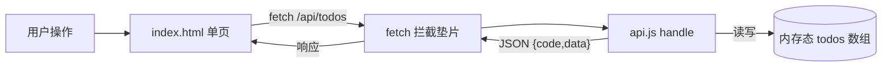
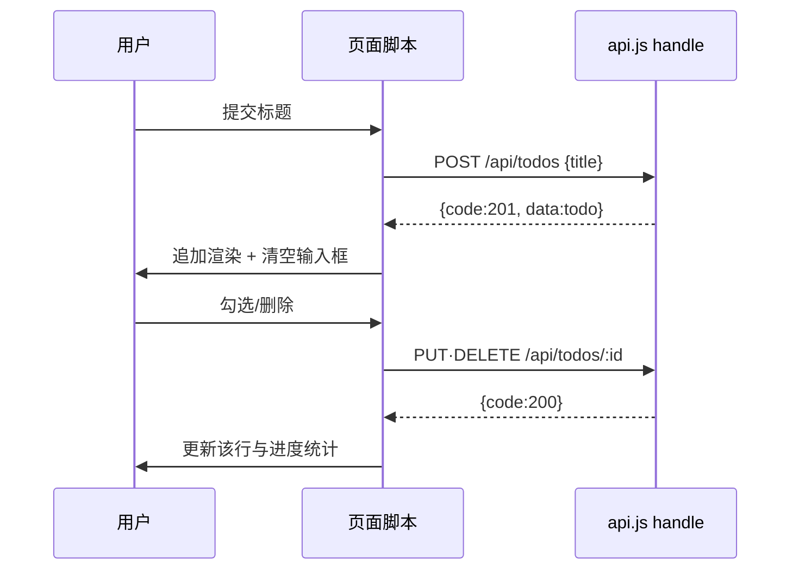

# 系统设计：轻量待办事项应用（Todo）

> 架构师产出（mock 样例）　来源 PRD：docs/prd.md
> 运行形态：浏览器内全栈（D2）——前端单页 + 无框架同构后端 `handle(method, path, body)`，
> 后端为内存态模块，预览时由平台把 api.js 与 fetch 拦截垫片注入 index.html。

## 1. 总体结构

- `app/frontend/index.html`：单页 UI，Tailwind CDN 引入样式，原生 JS，无构建步骤。
- `app/backend/api.js`：`module.exports = { handle }`，资源 = `/api/todos`，内存数组存储。
- 通信：前端统一 `fetch('/api/todos')`，由平台垫片拦截转交 `handle`，响应形如 `{ code, data }`。
- 约束：不落盘、不联网、不用 localStorage（iframe 无 same-origin），刷新即重置内存态。



## 2. 接口契约

| 方法 | 路径 | 入参 | 返回 |
| --- | --- | --- | --- |
| GET | /api/todos | - | `{code:200, data:[{id,title,done}]}` |
| POST | /api/todos | `{title}` | `{code:201, data:{id,title,done}}` |
| PUT/PATCH | /api/todos/:id | `{done?,title?}` | `{code:200, data:更新后条目}` |
| DELETE | /api/todos/:id | - | `{code:200, data:{ok:true}}` |

异常统一：未知路径/资源 → `{code:404, message}`；参数缺失 → `{code:400, message}`。

===== app/frontend/index.html =====

职责：渲染列表、提交表单、交互反馈。组件级规格：

- 顶部：标题 + 需求副标题（`text-sm text-neutral-500`）。
- 中部：新增表单（圆角输入框 + 黑色圆形「添加」按钮）。
- 列表：卡片式条目，完成项 `line-through text-neutral-400`；每项右侧删除按钮。
- 底部：进度统计与「内存态、刷新即重置」提示。



===== docs/file_tree.md =====

```json
[
  { "path": "docs/prd.md", "desc": "产品需求文档（PRD：功能清单/用户故事/验收标准）", "depends": [] },
  { "path": "docs/system_design.md", "desc": "系统设计说明（含 mermaid 架构与接口契约）", "depends": ["docs/prd.md"] },
  { "path": "app/backend/api.js", "desc": "内存态后端 handle(method,path,body)，资源 /api/todos", "depends": ["docs/system_design.md"] },
  { "path": "app/frontend/index.html", "desc": "待办单页（Tailwind CDN + fetch 调用 /api/todos）", "depends": ["app/backend/api.js"] },
  { "path": "start_app.sh", "desc": "预览启动说明（浏览器内全栈，无需安装依赖）", "depends": ["app/frontend/index.html"] }
]
```
